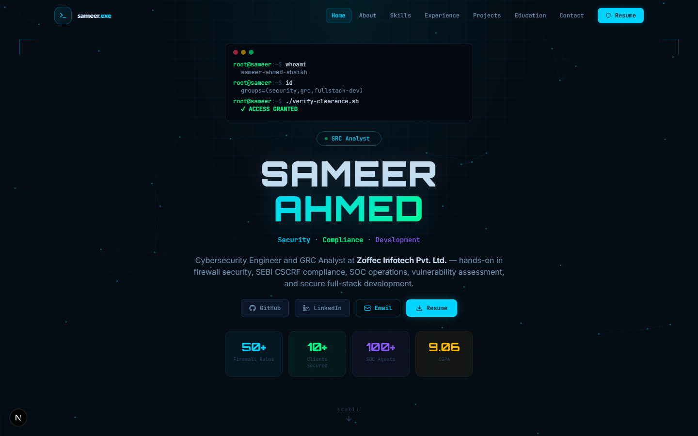

# Sameer Ahmed Shaikh — Portfolio

A cybersecurity-themed personal portfolio, built and presented as a live access-control console. Every section — About, Skills, Experience, Projects — is framed as a firewall ACL rule (`RULE 04 · PERMIT ANY → /projects [ACCEPT]`), which is Sameer's actual day-to-day vernacular as a Cybersecurity Engineer and GRC Analyst working on Sophos XGS firewall policy.

**Live:** [dollarsportfolio.vercel.app](https://dollarsportfolio.vercel.app)



---

## What this is

Sameer Ahmed Shaikh is a Cybersecurity Engineer & GRC Analyst at Zoffec Infotech Pvt. Ltd., working across Sophos firewall administration, SEBI CSCRF compliance assessments, SOC operations, and vulnerability assessment — and a full-stack developer with 2+ years of freelance MERN-stack delivery. This site is his portfolio and the single source of truth for his experience, skills, and shipped projects.

The design deliberately leans into that identity rather than a generic template: a dark navy/cyan "SOC console" aesthetic, a boot-sequence terminal in the hero that runs a real `whoami` → `id` → `./verify-clearance.sh` auth log, an ambient canvas network-topology backdrop, and section eyebrows written in ACL syntax instead of generic labels.

---

## Tech Stack

| Layer | Technology |
|---|---|
| Framework | Next.js 16.2.9 (App Router, Turbopack) |
| UI | React 19, Tailwind CSS, Framer Motion |
| Icons | Lucide React, React Icons (FA + SI) |
| Fonts | Pliant (headings), Orbitron (name), JetBrains Mono (terminal/data), Inter (body) |
| Type safety | TypeScript strict mode |
| Form backend | Formspree (server-side, endpoint never exposed to the client) |
| Validation | Zod |
| Deployment | Vercel |

---

## Project Structure

```
DollarsPortfolio2.0/
├── app/
│   ├── api/contact/route.ts   # Contact form API — rate limiting, CSRF, Zod validation
│   ├── globals.css            # Design tokens + Tailwind layers + ACL-rule eyebrow styles
│   ├── layout.tsx             # Root layout, SEO metadata, JSON-LD, fonts
│   └── page.tsx               # Assembles all sections
├── components/
│   ├── sections/
│   │   ├── HeroSection.tsx        # Auth-log terminal + canvas network backdrop
│   │   ├── AboutSection.tsx
│   │   ├── SkillsSection.tsx      # Filterable skill cloud (58 skills, size-weighted)
│   │   ├── ExperienceSection.tsx
│   │   ├── ProjectsSection.tsx    # Search + "Planned Builds" roadmap strip
│   │   ├── EducationSection.tsx
│   │   └── ContactSection.tsx
│   ├── RuleEyebrow.tsx        # The ACL-rule eyebrow used across every section
│   ├── HeroNetworkCanvas.tsx  # Ambient node-graph canvas (respects reduced motion)
│   ├── Navbar.tsx
│   └── Footer.tsx
├── lib/
│   ├── animations.ts          # Shared Framer Motion variants
│   ├── hooks/useReveal.ts     # Scroll-reveal hook
│   └── data/
│       ├── skills.ts          # 58 skills across 8 categories
│       └── projects.ts        # Shipped projects + queued "Planned Builds" ideas
├── public/
│   ├── assets/                # Images, logos, resume PDF
│   └── .well-known/
│       └── security.txt       # Vulnerability disclosure contact
└── next.config.mjs            # Security headers, redirects
```

---

## Environment Variables

Create a `.env.local` file (see `.env.example` for the full annotated version):

```env
NEXT_PUBLIC_SITE_URL=https://dollarsportfolio.vercel.app
FORMSPREE_ENDPOINT=https://formspree.io/f/YOUR_FORM_ID
```

- `NEXT_PUBLIC_SITE_URL` — used for SEO metadataBase, Open Graph URLs, JSON-LD, and the contact API's CORS origin check.
- `FORMSPREE_ENDPOINT` — your [Formspree](https://formspree.io) form URL. Kept server-side only — never sent to the browser.

---

## Getting Started

```bash
npm install --legacy-peer-deps
npm run dev
```

> `--legacy-peer-deps` is required because of an ESLint peer-dependency conflict with React 19.

Open [http://localhost:3000](http://localhost:3000).

```bash
npm run build   # production build
npm run start   # serve the production build locally
npm run lint    # ESLint
```

---

## Security Features

- **Content Security Policy** — restricts script, style, font, image, and frame sources
- **HSTS** — `max-age=63072000; includeSubDomains; preload`
- **X-Frame-Options: DENY** + `frame-ancestors 'none'` in CSP
- **X-Content-Type-Options: nosniff**
- **Referrer-Policy: strict-origin-when-cross-origin**
- **Cross-Origin-Opener-Policy / Resource-Policy: same-origin**
- **X-DNS-Prefetch-Control: off**
- **X-Permitted-Cross-Domain-Policies: none**
- **Permissions-Policy** — blocks camera, mic, geolocation, payment, browsing-topics
- **API route** — CSRF origin check, Content-Type guard, Zod validation, honeypot field, rate limiting (3 req/hr per IP), all non-POST methods return 405
- **JSON-LD XSS protection** — `</script>` sequences escaped before injection
- **security.txt** — `/.well-known/security.txt` for responsible disclosure

---

## Deployment

The project is live on **Vercel**, which is the natural target for a Next.js App Router site — zero-config builds, edge-network delivery, and first-class support for the API route, image optimization, and analytics already wired in.

### Deploy your own copy

1. **Push to GitHub.** Vercel deploys straight from a repo.
2. **Import the project** at [vercel.com/new](https://vercel.com/new) → select the repo → framework preset auto-detects as Next.js.
3. **Set environment variables** under **Settings → Environment Variables** (Production + Preview):
   - `NEXT_PUBLIC_SITE_URL` — your deployed URL
   - `FORMSPREE_ENDPOINT` — your Formspree endpoint
4. **Deploy.** Every push to `main` auto-deploys to production; every PR gets its own preview URL.
5. **Custom domain (optional):** **Settings → Domains** → add your domain → point its DNS (`A`/`CNAME`) at Vercel per the instructions shown. HTTPS is provisioned automatically.
6. **Enable Analytics & Speed Insights (optional):** both packages are already installed (`@vercel/analytics`, `@vercel/speed-insights`) — just flip them on under the project's **Analytics** and **Speed Insights** tabs; no code changes needed.

Once connected, redeploying is just `git push` — that's the "use it anytime" workflow: edit locally, commit, push, Vercel rebuilds and serves the new version automatically.

### Alternative: self-hosted / any Node host

The app is a standard Next.js build and isn't tied to Vercel:

```bash
npm run build
npm run start   # serves on port 3000 by default
```

This runs anywhere Node 18+ is available (a VPS, Railway, Render, Fly.io, a Docker container behind Nginx). The only Vercel-specific pieces are the `@vercel/analytics` and `@vercel/speed-insights` components in `app/layout.tsx` — they no-op harmlessly on other hosts, or can be removed.

---

## Contact

Sameer Ahmed Shaikh — [sameer.shaikh0425@gmail.com](mailto:sameer.shaikh0425@gmail.com)

GitHub: [@shaikhsameer18](https://github.com/shaikhsameer18) · LinkedIn: [sameerahmed08](https://linkedin.com/in/sameerahmed08)
